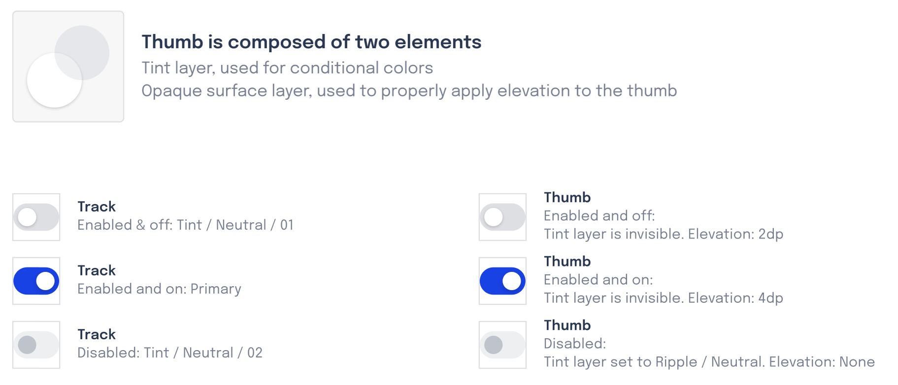

# 🌊 Seaside

Seaside is OceanBit's component library. It's:
- Highly customizable
- Highly Accessible
- Feature-rich
- Made from scratch

Here's a tiny tiny preview:

While Seaside is open-source, until we release our 1.0, all of our documentation, issue tracking, 
and more are all sponsor-only and tracked in [this repo](https://github.com/oceanbit/seaside-docs) - which
is private unless you are a sponsor.

> Want to see what's going on behind-the-scenes?
>
> Gain access to our design files, specs, installation instructions, documentation, issue tracker,
and more by [sponsoring us on GitHub](https://github.com/sponsors/crutchcorn)!
> 
> 
